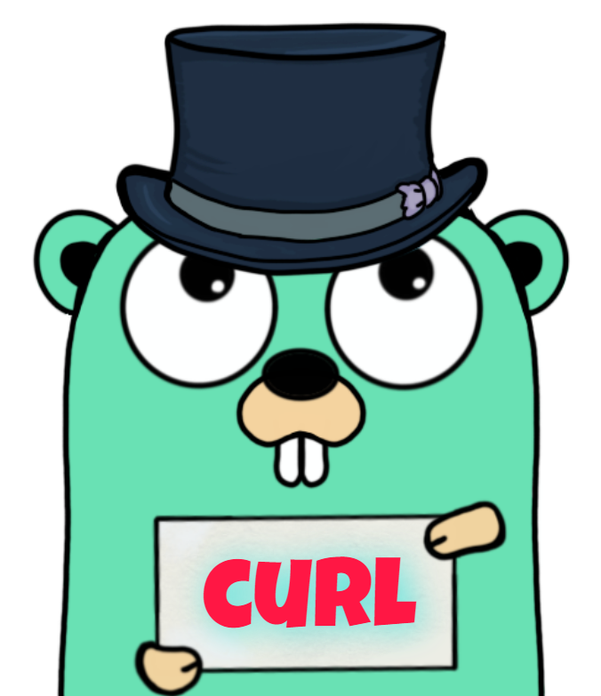

<p align="center">

</p>
<p align="center">
<a href="https://pkg.go.dev/github.com/mehditeymorian/koi/v3?tab=doc"target="_blank">
    
</a>


</p>

# curl
curl is a lightweight package for rendering http request and response from curl string with Go


# Documentation

## Install

```bash
go get github.com/erfanmomeniii/curl
```   

Next, include it in your application:

```bash
import "github.com/erfanmomeniii/curl"
``` 

## Quick Start

The following example demonstrates how to use this package for generating request and response from curl:

```go
package main

import (
	"fmt"
	"github.com/erfanmomeniii/curl"
)

func main() {
	c, _ := curl.New("curl -H \"Test1:no\" -H \"Test2:yes\" -d \"User=foobar\" www.google.com")

	request := c.Request()
	response, _ := c.Response()

	fmt.Println(request, response)
}

```
## Contributing
Pull requests are welcome. For changes, please open an issue first to discuss what you would like to change.
Please make sure to update tests as appropriate.
